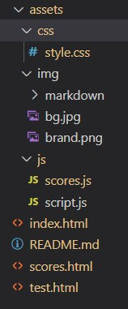
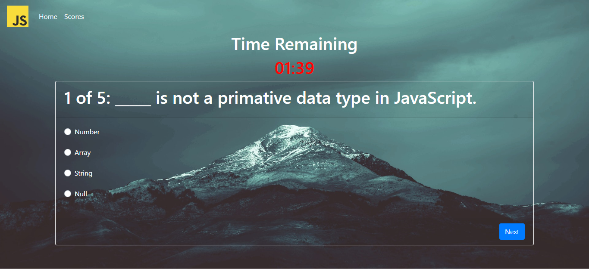
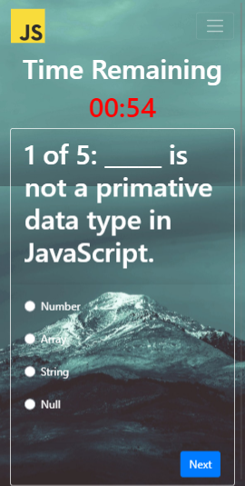
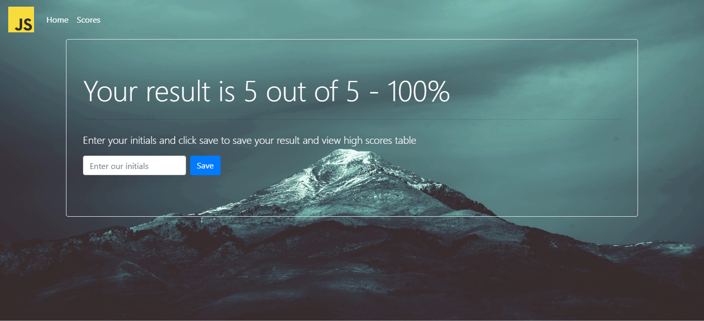
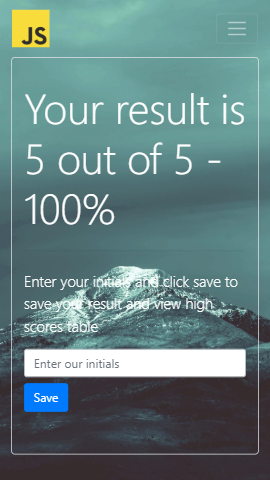
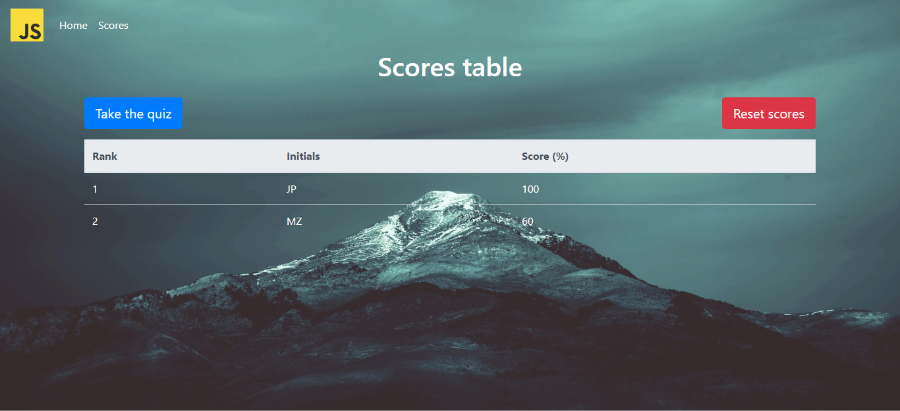
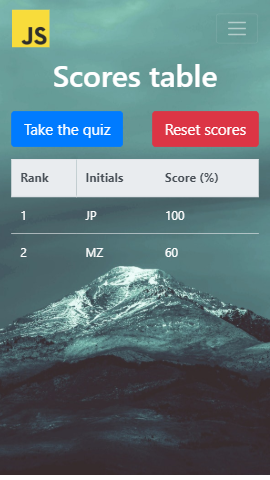

# Code Quiz

## Description

This is an app that includes a timed quiz to test your JavaScript basic knowledge. The quiz is a series of multiple choice single answer questions and includes functionality to store and display scores history using local storage.

[Click here to the view the deployed website on github-pages](https://mohamedzakigithub.github.io/code-quiz/)

## Table of Contents

- [Folders and files structure](#Folders-and-files-structure)
- [HTML](#HTML)
- [Styling and responsiveness](#Styling-and-responsiveness)
- [Quiz app](#Quiz-app)
- [Scores](#Scores)
- [Further development](#Further-development)

## Folders and files structure

The app consists of three HTML files (index.html, test.html and scores.html)
style sheets, images and JS files are located in assets folder.



## HTML

### index.html

This is is home page of the app. the page has a button with a link to the quiz page(test.html)

### test.html

This is the file that will serve the quiz.

### scores.html

This page has a table which is pupolated with the scores history in the browsers local storage.

## Styling and responsiveness

The app uses Bootstrap 4 for styling to insure a sleek and responsive design. Minimal custom styling was added inline and in a separate style sheet. Some Bootstrap 4 components used include Navbar, Jumbotron, cards and custom controls. Bootstrap 4 classes were used to show and hide components. Below are screenshots of the app in desktop and mobile.








## Quiz app

### Variable declarations and DOM elements selections.

In this section the DOM elemenets are selected using the query selector. This includes DIV elements, buttons and inputs. Other variables are set as well like the current Card and the quiz time.

```javascript
// Variables declarations and DOM elements selector.

var jumbotron = document.querySelector("#jumbotron");
var card = document.querySelector("#card");
var question = document.querySelector("#question");
var optionLabel = document.querySelectorAll("label");
var radio = document.querySelectorAll(".radio");
var startBtn = document.querySelector("#startBtn");
var previousBtn = document.querySelector("#previousBtn");
var nextBtn = document.querySelector("#nextBtn");
var submitBtn = document.querySelector("#submitBtn");
var timerEl = document.querySelector("#timer");
var minutesEl = document.querySelector("#minutes");
var secondsEl = document.querySelector("#seconds");
var resultEl = document.querySelector("#result");
var initials = document.querySelector("#initials");
var saveBtn = document.querySelector("#save");
var alertEl = document.querySelector("#alert");
var resultCardEl = document.querySelector("#resultCard");
var time = 120;
var currCard = 0;
var scoresList = [];
var scoreObj = {
  initials: "",
  score: ""
};
```

### Questions list

Here we declare a list of objects of questions and answers.

```javascript
// List of objects containing questions, possible answers list,
// correct answer and selected answer by the user.

var questionsList = [
  {
    question: "**_** is not a primative data type in JavaScript.",
    answers: ["Number", "Array", "String", "Null"],
    correctAnswer: "Array",
    selectedAnswer: ""
  },
  {
    question: "JavaScript code is enclosed in **_** tag in HTML document.",
    answers: ["<code>", "<style>", "<script>", "<link>"],
    correctAnswer: "<script>",
    selectedAnswer: ""
  },
  {
    question: "**_** is the symbol of logical AND operator in JavaScript.",
    answers: ["+", "&&", "AND", "&"],
    correctAnswer: "&&",
    selectedAnswer: ""
  },
  {
    question:
      "**_** function is used to display a string or a variable to the console.",
    answers: ["print()", "text.log()", "write()", "console.log()"],
    correctAnswer: "console.log()",
    selectedAnswer: ""
  },
  {
    question: "In JavaScript, DOM stands for **_**.",
    answers: [
      "Day Of Month",
      "Document Object Model",
      "Data Object Model",
      "Document Object Manipulation"
    ],
    correctAnswer: "Document Object Model",
    selectedAnswer: ""
  }
];
```

## Event listeners

Add event listeners to all the buttons in the app and set callback functions to each listener.

```javascript
// Event listener for the start quiz button that calls the startQuiz function.

startBtn.addEventListener("click", startQuiz);

// Event listener for the next button that displays the next question
// with a callback function calling displayCard function.

nextBtn.addEventListener("click", function(event) {
  event.preventDefault();
  for (let j = 0; j < radio.length; j++) {
    if (radio[j].checked)
      questionsList[currCard].selectedAnswer = radio[j].value;
  }
  currCard++;
  displayCard(currCard);
});

// Event listener for the previous button that displays the previous question
// with a callback function calling displayCard function.

previousBtn.addEventListener("click", function(event) {
  event.preventDefault();
  for (let j = 0; j < radio.length; j++) {
    if (radio[j].checked)
      questionsList[currCard].selectedAnswer = radio[j].value;
  }
  currCard--;
  displayCard(currCard);
});

// Event listener for the submit button that calls the endQuiz function.

submitBtn.addEventListener("click", function(event) {
  event.preventDefault();
  for (let j = 0; j < radio.length; j++) {
    if (radio[j].checked)
      questionsList[currCard].selectedAnswer = radio[j].value;
  }
  score = endQuiz();
});

// Event listener to save score button with a callback function to check for
// and saves the scores in a scores object then saves it to local storage.

saveBtn.addEventListener("click", function(event) {
  event.preventDefault();
  if (initials.value.trim() === "") {
    alertEl.classList.remove("d-none");
  } else {
    score = endQuiz();
    scoreObj.initials = initials.value;
    scoreObj.score = (score / 5) * 100;
    scoresList = JSON.parse(localStorage.getItem("scores")) || [];
    scoresList.push(scoreObj);
    localStorage.setItem("scores", JSON.stringify(scoresList));
    location.href = "./scores.html";
  }
});
```

### Functions

In this section of the quiz app we define functions that will be called by event listeners and perform different tasks and calculations. (see code comments for a description of each function).

```javascript
// Function to start the quiz. Display the first question and start the timer function.

function startQuiz() {
  jumbotron.classList.add("d-none");
  card.classList.remove("d-none");
  timer();
  displayCard(currCard);
}

// The main timer function. The function calls the display time function every second and checks
// if the time is up and calls the endQuiz function.

function timer() {
  setInterval(function() {
    time--;
    if (time > 0) {
      displayRemainingTime();
    } else {
      endQuiz();
    }
  }, 1000);
}

// Function to format and display the remaining time.

function displayRemainingTime() {
  minutesEl.textContent =
    Math.floor(time / 60) < 10
      ? "0" + Math.floor(time / 60)
      : Math.floor(time / 60);
  secondsEl.textContent = time % 60 < 10 ? "0" + (time % 60) : time % 60;
}

// Function to  pick the question from the questions list and display the
// question and the possible answer by manipulating the DOM.

function displayCard(i) {
  switch (i) {
    case 0:
      previousBtn.classList.add("d-none");
      break;
    case 4:
      nextBtn.classList.add("d-none");
      submitBtn.classList.remove("d-none");
      break;
    default:
      nextBtn.classList.remove("d-none");
      previousBtn.classList.remove("d-none");
      submitBtn.classList.add("d-none");
  }
  question.textContent = i + 1 + " of 5: " + questionsList[i].question;
  optionLabel.forEach(function(arr, j) {
    arr.textContent = questionsList[i].answers[j];
  });
  radio.forEach(function(arr, j) {
    arr.value = questionsList[i].answers[j];
    if (radio[j].value == questionsList[i].selectedAnswer) {
      radio[j].checked = true;
    } else {
      radio[j].checked = false;
    }
  });
}

// Function to check the answer for each question and compares it to the correct answer
// then displays the score.

function endQuiz() {
  var score = 0;
  for (let i = 0; i < questionsList.length; i++) {
    if (questionsList[i].selectedAnswer === questionsList[i].correctAnswer)
      score++;
  }
  card.classList.add("d-none");
  timerEl.classList.add("d-none");
  resultCardEl.classList.remove("d-none");
  resultEl.textContent = score + " out of 5 - " + (score / 5) * 100 + "%";
  return score;
}
```

## Scores

The scores app checks local storage for saved scores object then retrieves this object by using JSON parse then populates a table with the saved scores after sorting the array according to score. The scores app has a button that resets the scores.

```javascript
// Elements selection and variables declarations

var table = document.querySelector("tbody");
var resetBtn = document.querySelector("#reset");
var row;
var data;

// Get scores object from local storage and sort in case of more than one record

var scoresList = JSON.parse(localStorage.getItem("scores"));
if (scoresList && scoresList.length > 1) {
  scoresList.sort(compare);
}

// Render table function invocation

renderTable();

// Render table function by creating rows and data cells wiith values
// from local storage and appending to table. If no stored scores, the function will create
//  a an element and display message.

function renderTable() {
  table.innerHTML = "";
  if (scoresList) {
    for (let i = 0; i < scoresList.length; i++) {
      row = document.createElement("tr");
      table.appendChild(row);
      data = document.createElement("td");
      data.textContent = i + 1;
      row.appendChild(data);
      for (let key in scoresList[i]) {
        data = document.createElement("td");
        data.textContent = scoresList[i][key];
        row.appendChild(data);
      }
    }
  } else {
    row = document.createElement("tr");
    table.appendChild(row);
    data = document.createElement("td");
    data.textContent = "No scores saved";
    row.appendChild(data);
  }
}

// Adding event listener to reset button and clear local storage.

resetBtn.addEventListener("click", function() {
  localStorage.removeItem("scores");
  renderTable();
  location.reload();
});

// compare function to pass to sort function to sort the scores according to score.

function compare(a, b) {
  const A = a.score;
  const B = b.score;
  let comparison = 0;
  if (A < B) {
    comparison = 1;
  } else if (A > B) {
    comparison = -1;
  }
  return comparison;
}
```

## Further development

This is a modified version of the app featuring sliding question cards on clicking the next/previous buttons and tha ability to sort the scores table by scores by ascending or descending order.

- [Modified version on github-pages](https://mohamedzakigithub.github.io/code-quiz-new-features/)
- [Modified version repository](https://github.com/mohamedzakigithub/code-quiz-new-features)
